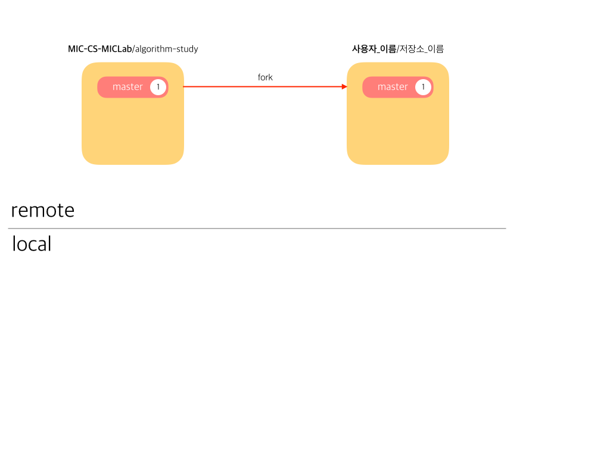
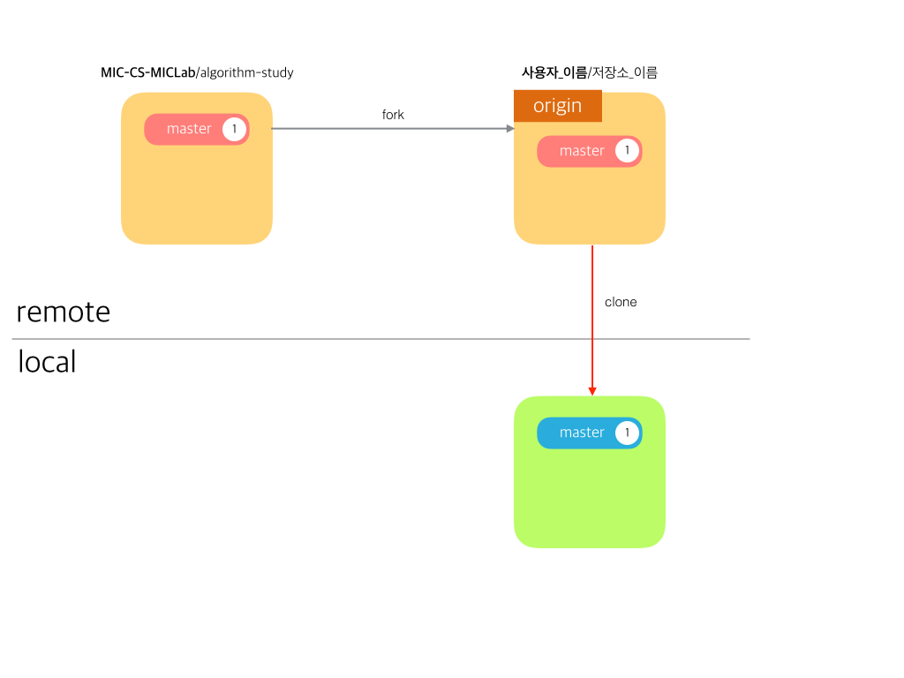
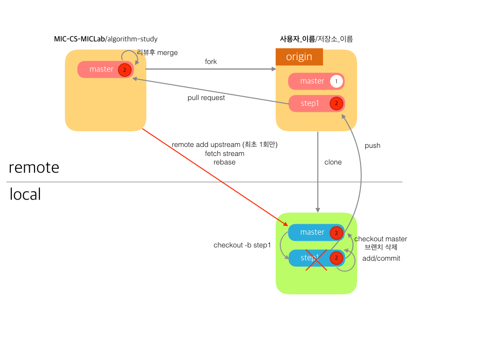

# 코드 리뷰 과정

1. 프로젝트를 자신의 계정으로 fork 한다.



2. fork한 프로젝트를 local(자신의 컴퓨터)로 clone을 한 후 디렉토리로 이동한다. 
```
git clone https://github.com/{본인_아이디}/{저장소_아이디}
ex) git clone https://github.com/seunguklee/algorithm-study
```
```
cd {저장소_아이디}
ex) cd algorithm-study
```


3. 문제 풀이 또는 개념 정리 등 특정 작업을 하기 위한 브랜치를 새로 생성한다.
```
git checkout -b {브랜치_이름}
ex) git checkout -b "step1"
// -b 옵션을 사용하면 브랜치를 생성하고 그 브랜치로 이동할 수 있다.
```


4. 문제를 풀고 add / commit 한다.
```
git add 파일명
git commit -m "message"

ex) git add .  ( .(dot)을 사용하면 변화가 있는 모든 파일을 반영한다.)
    git commit -m "seunguk solve baekjoon_1000 and add 1000.cpp file"
```


5. 자신의 원격 저장소에 push 한다.
```
git push origin 브랜치이름
ex) git push origin master
```


6. PR(pull request)를 보낸다.

> 피드백을 받으면 코드를 수정한 후 add, commit, push 작업 반복.


7. 리뷰어는 피드백을 마무리하고 KSU-CS-MICLab/algorithm-study 저장소에 merge한다. **(Owner인 사람만 해당)**


8. merge가 완료했다는 통보를 받으면 브랜치 변경 및 브랜치 삭제(option)한다.
```
git checkout {브랜치_이름}
git branch -D {삭제할_브랜치이름}
ex) git checkout master
ex) git branch -D step1
```


9. KSU-CS-MICLab/algorithm-study 저장소와 동기화하기 위해 저장소 추가 **(최소 1번만 실행)** [remote add]</br> KSU-CS-MICLab/algorithm-study 저장소에서 브랜치를 들고온다. [fetch]</br> KSU-CS-MICLab/algorithm-study 저장소와 동기화하기.[rebase]
   
```
git remote add {저장소_별칭} {base_저장소_url}
ex) git remote add upstream https://github.com/KSU-CS-MICLab/algorithm-study.git
// 위와 같이 upstream으로 저장소를 추가한 후 전체 remote 저장소 목록을 본다.
git remote -v
``` 
```
git fetch upstream {브랜치_이름}
ex) git fetch upstream master
```
```
git rebase upstream/{브랜치_이름}
ex) git rebase upstream/master
```


10. 3단계 부터 다시 진행하여 반복하면 된다.
